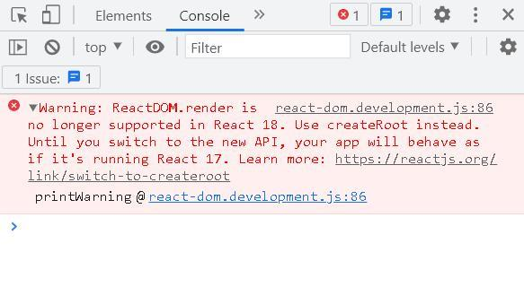
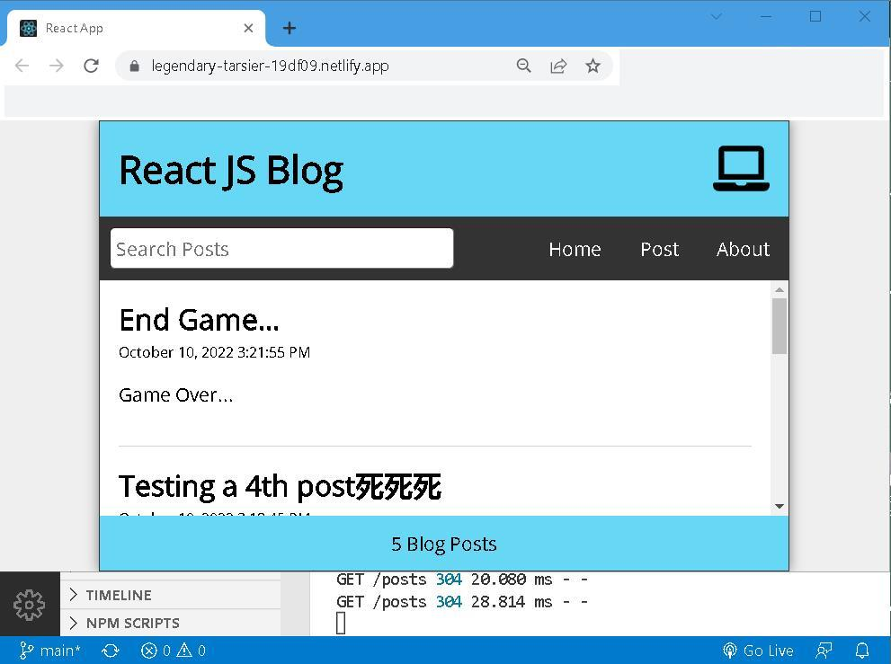

# react-js-blog


## Forward
<span style="font-size: 36px; font-weight: bold;">T</span>oday is the future of yesterday; today is the yesterday of future. Retrospect more relates to remembrance, we all live in the past and like backing to the past. Not only to evidence historical events but also to invigorate, as it could be, and to rejuvenate, as it should be, of oneself. 

The idea of [SPA](https://en.wikipedia.org/wiki/Single-page_application) is not new, in a way, is more [client/server model](https://en.wikipedia.org/wiki/Client%E2%80%93server_model) than [web page](https://en.wikipedia.org/wiki/Web_page). Web server, however, serves only for **deployment** and **API end-points**. It's time to revive your body and soul by revisiting old friends. 


## I. When 'async' is not possible but 'await' is needed
In case you just can't tag <code>async</code> ahead of functions, a witty workaround is to define an async *inner function*, and put all <code>await</code>s inside there. Then call the inner function at the very end. 

```javascript
// Initial load
  useEffect(() => {
    const fetchPosts = async () => {
      try {
        const response = await api.get('/posts')        
        setPosts(response.data)
      }
      catch (err) {
        if (err.response) {
          // Not in the 200 response range
          console.log(err.response.data)
          console.log(err.response.status)
          console.log(err.response.header)
        }
        else {
          console.log(`Error: ${err.message}`)
        }
      }
    }

    fetchPosts()
  }, [])
```


## II. No need to install [json-server](https://www.npmjs.com/package/json-server) at all
Previously, we install json-server via <code>npm install json-server --save-dev</code>. You can also run packages without installing by means of [npx](https://www.npmjs.com/package/npx).  

```
npx json-server data/db.json --watch --port 3500 --static ./build
```
Everything works the same. The only difference is that if npx can't find the required package locally, it will download it automatically. 

> npx helps us avoid versioning, dependency issues and installing unnecessary packages that we just want to try out.

> It also provides a clear and easy way of executing packages, commands, modules and even GitHub gists and repositories.


## III. React Router v6 retrofit
App.js (before)
```javascript 
return (
    <div className="App">
      <Header title="React JS Blog" />
      <Nav />
      <Switch>
        <Route exact path="/">
          <Home
            isLoading={isLoading}
            fetchError={fetchError}
          />
        </Route>
        <Route exact path="/post" component={NewPost} />
        <Route path="/edit/:id" component={EditPost} />
        <Route path="/post/:id" component={PostPage} />
        <Route path="/about" component={About} />
        <Route path="*" component={Missing} />
      </Switch>
      <Footer />
    </div>
  );
```

App.js (after)
```javascript
return (
    <DataProvider>
      <Routes>
        <Route path="/" element={<Layout title="React JS Blog" />} >
            <Route index element={<Home />} />
            
            <Route path="post">
                <Route index element={<NewPost />} />
                <Route path=":id" element={<PostPage />} />
            </Route>

            <Route path="/edit/:id" element={<EditPost />} />
            <Route path="about" element={<About />} />
            <Route path="*" element={<Missing />} />
        </Route>
      </Routes>
    </DataProvider>
  );
```


## IV. Use [axios](https://www.npmjs.com/package/axios) to facilitate [Fetch API](https://developer.mozilla.org/en-US/docs/Web/API/Fetch_API/Using_Fetch)
> The Fetch API provides a JavaScript interface for accessing and manipulating parts of the protocol, such as requests and responses. It also provides a global fetch() method that provides an easy, logical way to fetch resources asynchronously across the network.

> Axios is a simple promise based HTTP client for the browser and node.js. Axios provides a simple to use library in a small package with a very extensible interface.

api\posts.js
```javascript
import axios from 'axios'

export default axios.create({
    baseURL: 'http://localhost:3500'
})
```
App.js
```javascript 
import api from './api/posts'

// Initial load
  useEffect(() => {
    const fetchPosts = async () => {
      try {
        const response = await api.get('/posts')        
        setPosts(response.data)
      }
      catch (err) {
        if (err.response) {
          // Not in the 200 response range
          console.log(err.response.data)
          console.log(err.response.status)
          console.log(err.response.header)
        }
        else {
          console.log(`Error: ${err.message}`)
        }
      }
    }

    fetchPosts()
  }, [])

// Add post 
  const handleSubmit = async (e) => {
    e.preventDefault();
    const id = posts.length ? posts[posts.length - 1].id + 1 : 1;
    const datetime = format(new Date(), 'MMMM dd, yyyy pp');
    const newPost = { id, title: postTitle, datetime, body: postBody };

    try {
      const response = await api.post('/posts', newPost)
      // const allPosts = [...posts, newPost];
      const allPosts = [...posts, response.data];
      setPosts(allPosts);  
      setPostTitle('');
      setPostBody('');
      navigate('/');
    }
    catch (err) {
        console.log(`Error: ${err.message}`)
    }
  }

  // Update post
  const handleEdit = async (id) => {
    const datetime = format(new Date(), 'MMMM dd, yyyy pp');
    const updatePost = { id, title: editTitle, datetime, body: editBody };

    try {
      const response = await api.put(`/posts/${id}`, updatePost)
      setPosts(posts.map(post => post.id === id ? { ...response.data } : post))
      setEditTitle('');
      setEditBody('');
      navigate('/');
    }
    catch (err) {
      console.log(`Error: ${err.message}`)
    }
  }

  // Delete post
  const handleDelete = async (id) => {
    try {
      await api.delete(`/posts/${id}`)

      const postsList = posts.filter(post => post.id !== id);
      setPosts(postsList);
      navigate('/');
    }
    catch (err) {
      console.log(err.message)
    }
  }
```


## V. Upgrade to React 18


```javascript
// Before 
import ReactDOM from 'react-dom';

ReactDOM.render(
  <React.StrictMode>
    <Router>
      <Routes>
        <Route path="/*" element={<App />} />
      </Routes>
    </Router>
  </React.StrictMode>,
  document.getElementById('root')
);
```

```javascript
// After 
import { createRoot } from 'react-dom/client';

const container = document.getElementById('root');
const root = createRoot(container); // createRoot(container!) if you use TypeScript
root.render(
    <React.StrictMode>
      <Router>
        <Routes>
          <Route path="/*" element={<App />} />
        </Routes>
      </Router>
    </React.StrictMode>
   );
```


## VI. Custom react hook as a kind of utility function 

- Only Call Hooks at the Top Level. 

- Don’t call Hooks inside loops, conditions, or nested functions. I

- Only Call Hooks from React Functions. 

- Don’t call Hooks from regular JavaScript functions.

hooks\useWindowSize.js
```javascript
import { useState, useEffect } from 'react'

const useWindowSize = () => {
    const [ windowSize, setWindowSize ] = useState({
        width: undefined, 
        height: undefined
    })

    useEffect( ()=> {
            const handleResize = () => {
                setWindowSize({
                    width: window.innerWidth, 
                    height: window.innerHeight
                })
            }
            handleResize()
            window.addEventListener('resize', handleResize)
            // returns the cleanup function 
            return ()=>window.removeEventListener('resize', handleResize)
        }, [])

    // returns the custom hook, which is more like a utility function.  
    return windowSize    
}

export default useWindowSize
```

hooks\useAxiosFetch.js
```javascript
import { useState, useEffect } from 'react';
import axios from 'axios';

const useAxiosFetch = (dataUrl) => {
    const [data, setData] = useState([]);
    const [fetchError, setFetchError] = useState(null);
    const [isLoading, setIsLoading] = useState(false);

    useEffect(() => {
        let isMounted = true;
        const source = axios.CancelToken.source();

        const fetchData = async (url) => {
            setIsLoading(true);
            try {
                const response = await axios.get(url, {
                    cancelToken: source.token
                });
                if (isMounted) {
                    setData(response.data);
                    setFetchError(null);
                }
            } catch (err) {
                if (isMounted) {
                    setFetchError(err.message);
                    setData([]);
                }
            } finally {
                isMounted && setTimeout(() => setIsLoading(false), 1000 )
                // isMounted && setIsLoading(false);
            }
        }

        fetchData(dataUrl);        

        const cleanUp = () => {
            console.log('clean up function')
            isMounted = false            
            source.cancel();
        }

        return cleanUp;
    }, [dataUrl]);

    return { data, fetchError, isLoading };
}

export default useAxiosFetch;
```


## VII. Properties vs [useContext](https://reactjs.org/docs/hooks-reference.html#usecontext)
> The React context provides data to components no matter how deep they are in the components tree. The context is used to manage global data, e.g. global state, theme, services, user settings, and more.

Using properties to pass parameters: 
```javascript
   return (
    <Routes>
      <Route path="/" element={<Layout
        search={search}
        setSearch={setSearch}
        width={width}
      />}>
          <Route index element={<Home 
            posts={searchResults} 
            fetchError={fetchError}
            isLoading={isLoading}
          />} />
          
          <Route path="post">
              <Route index element={<NewPost
                handleSubmit={handleSubmit}
                postTitle={postTitle}
                setPostTitle={setPostTitle}
                postBody={postBody}
                setPostBody={setPostBody}
              />} />

              <Route path=":id" element={<PostPage
                posts={posts}
                handleDelete={handleDelete}
              />} />
          </Route>

          <Route path="/edit/:id" element={<EditPost
                posts={posts}
                handleEdit={handleEdit}
                editTitle={editTitle}
                setEditTitle={setEditTitle}
                editBody={editBody}
                setEditBody={setEditBody}
          />} />

          <Route path="about" element={<About />} />
          <Route path="*" element={<Missing />} />
      </Route>
    </Routes>
  );
```

Using DataProvider to pass parameters:
```javascript
. . . 
import { DataProvider } from './context/DataContext';
. . . 
   return (
    <DataProvider>
      <Routes>
        <Route path="/" element={<Layout title="React JS Blog" />} >
          
            <Route index element={<Home />} />
            
            <Route path="post">
                <Route index element={<NewPost />} />
                <Route path=":id" element={<PostPage />} />
            </Route>

            <Route path="/edit/:id" element={<EditPost />} />

            <Route path="about" element={<About />} />
            <Route path="*" element={<Missing />} />
        </Route>
      </Routes>
    </DataProvider>
  );
```

context\DataContext.js
```javascript
import { createContext, useState, useEffect } from 'react'
import { useNavigate } from 'react-router-dom';
import api from '../api/posts'
import useWindowSize from '../hooks/useWindowSize';
import useAxiosFetch from '../hooks/useAxiosFetch';
import { format } from 'date-fns';

const DataContext = createContext({})

export const DataProvider = ({ children }) => {
    const [posts, setPosts] = useState([])
    const [search, setSearch] = useState('');
    const [searchResults, setSearchResults] = useState([]);
    const [postTitle, setPostTitle] = useState('');
    const [postBody, setPostBody] = useState('');
    const [editTitle, setEditTitle] = useState('');
    const [editBody, setEditBody] = useState('');
    const navigate = useNavigate();
    const { width } = useWindowSize()
    const { data, fetchError, isLoading } = useAxiosFetch('http://localhost:3500/posts')
  
    // Initial load using custom hook 
    useEffect( () => {
      setPosts(data)
    }, [data] )
  
    // Search 
    useEffect(() => {
      const filteredResults = posts.filter((post) =>
        ((post.body).toLowerCase()).includes(search.toLowerCase())
        || ((post.title).toLowerCase()).includes(search.toLowerCase()));
  
      setSearchResults(filteredResults.reverse());
    }, [posts, search])

    // Add post 
    const handleSubmit = async (e) => {
        e.preventDefault();
        const id = posts.length ? posts[posts.length - 1].id + 1 : 1;
        const datetime = format(new Date(), 'MMMM dd, yyyy pp');
        const newPost = { id, title: postTitle, datetime, body: postBody };

        try {
            const response = await api.post('/posts', newPost)
            // const allPosts = [...posts, newPost];
            const allPosts = [...posts, response.data];
            setPosts(allPosts);  
            setPostTitle('');
            setPostBody('');
            navigate('/');
        }
        catch (err) {
            console.log(`Error: ${err.message}`)
        }
    }

    // Update post
    const handleEdit = async (id) => {
        const datetime = format(new Date(), 'MMMM dd, yyyy pp');
        const updatePost = { id, title: editTitle, datetime, body: editBody };

        try {
            const response = await api.put(`/posts/${id}`, updatePost)
            setPosts(posts.map(post => post.id === id ? { ...response.data } : post))
            setEditTitle('');
            setEditBody('');
            navigate('/');
        }
        catch (err) {
            console.log(`Error: ${err.message}`)
        }
    }

    // Delete post
    const handleDelete = async (id) => {
        try {
            await api.delete(`/posts/${id}`)

            const postsList = posts.filter(post => post.id !== id);
            setPosts(postsList);
            navigate('/');
        }
        catch (err) {
            console.log(err.message)
        }
    }
  
    return (
        <DataContext.Provider value={{
            width, search, setSearch, 
            searchResults, fetchError, isLoading, 
            handleSubmit, postTitle, setPostTitle, postBody, setPostBody, 
            posts, setPosts, 
            handleEdit, editTitle, setEditTitle, editBody, setEditBody, 
            handleDelete
        }}>
            {children}
        </DataContext.Provider>
    )
}

export default DataContext 
```

Header.js
```javascript
import { FaLaptop, FaTabletAlt, FaMobileAlt } from 'react-icons/fa'

import { useContext } from 'react'
import DataContext from './context/DataContext'

const Header = ({ title }) => {
    const { width } = useContext(DataContext)
    
    return ( 
        <header className="Header">
            <h1>{ title }</h1>
            { width < 768 ? <FaMobileAlt /> : 
                        width < 992 ? <FaTabletAlt/ > : <FaLaptop /> }
        </header>        
     );
}
 
export default Header;
```


## VIII. State management via [Easy Peasy](https://easy-peasy.vercel.app/)
> Easy Peasy is an abstraction of Redux, providing a reimagined API that focuses on developer experience. It allows you to quickly and easily manage your state, whilst leveraging the strong architectural guarantees and extensive eco-system that Redux has to offer.

store.js
```javascript
import { createStore, action, thunk, computed } from "easy-peasy";
import api from './api/posts';

export default createStore({
    posts: [],
    setPosts: action((state, payload) => {
        state.posts = payload;
    }),
    postTitle: '',
    setPostTitle: action((state, payload) => {
        state.postTitle = payload;
    }),
    postBody: '',
    setPostBody: action((state, payload) => {
        state.postBody = payload;
    }),
    editTitle: '',
    setEditTitle: action((state, payload) => {
        state.editTitle = payload;
    }),
    editBody: '',
    setEditBody: action((state, payload) => {
        state.editBody = payload;
    }),
    search: '',
    setSearch: action((state, payload) => {
        state.search = payload;
    }),
    searchResults: [],
    setSearchResults: action((state, payload) => {
        state.searchResults = payload;
    }),
    postCount: computed((state) => state.posts.length),
    getPostById: computed((state) => {
        return (id) => state.posts.find(post => (post.id).toString() === id);
    }),
    
    savePost: thunk(async (actions, newPost, helpers) => {
        const { posts } = helpers.getState();
        try {
            const response = await api.post('/posts', newPost);
            actions.setPosts([...posts, response.data]);
            actions.setPostTitle('');
            actions.setPostBody('');
        } catch (err) {
            console.log(`Error: ${err.message}`);
        }
    }),
    deletePost: thunk(async (actions, id, helpers) => {
        const { posts } = helpers.getState();
        try {
            await api.delete(`/posts/${id}`);
            actions.setPosts(posts.filter(post => post.id !== id));
        } catch (err) {
            console.log(`Error: ${err.message}`);
        }
    }),
    editPost: thunk(async (actions, updatedPost, helpers) => {
        const { posts } = helpers.getState();
        const { id } = updatedPost;
        try {
            const response = await api.put(`/posts/${id}`, updatedPost);
            actions.setPosts(posts.map(post => post.id === id ? { ...response.data } : post));
            actions.setEditTitle('');
            actions.setEditBody('');
        } catch (err) {
            console.log(`Error: ${err.message}`);
        }
    })
});
```

index.js
```javascript
. . . 
import { StoreProvider } from 'easy-peasy'
import store from './store'
. . . 
root.render(
    <React.StrictMode>
      <StoreProvider store={store}>
        <Router>
          <Routes>
            <Route path="/*" element={<App />} />
          </Routes>
        </Router>
      </StoreProvider>
    </React.StrictMode>
   );
. . . 
```

Footer.js
```javascript
import { useStoreState } from 'easy-peasy'

const Footer = () => {
    const postCount = useStoreState((state)=>state.postCount )
    return (
        <footer className='Footer'>
            <p>{postCount} Blog Posts</p>
        </footer>
    )
}

export default Footer
```


## IX. Deploy to [Netlify](https://app.netlify.com/)
> Netlify is an all-in-one platform for automating modern web projects. Replace your hosting infrastructure, continuous integration, and deployment pipeline with a single workflow. Integrate dynamic functionality like serverless functions, user authentication, and form handling as your projects grow.

-  [online link](https://legendary-tarsier-19df09.netlify.app/)




## X. Summary 
To be honest, nobody has yet succeeded in going to the past. It is said that in the theory of Quantum physics, everything can be decomposed into particles, if light, per se, is particle, and if we *can* change the direction of those particles, may be we can change the time. Believe it or not... ? 

A more practical and feasible way to go the past is to stare at a mirror, the image you saw inside is the very past of you. 


## XI. Reference
1. [React JS Full Course for Beginners | Complete All-in-One Tutorial | 9 Hours](https://youtu.be/RVFAyFWO4go)
2. [React Router v6 in 20 Minutes | RRv6 Upgrade & Refactor Tutorial](https://youtu.be/XBRLVRjZ3CQ)
3. [How to Upgrade to React 18](https://reactjs.org/blog/2022/03/08/react-18-upgrade-guide.html#updates-to-client-rendering-apis )
4. [npm vs npx — What’s the Difference?](https://www.freecodecamp.org/news/npm-vs-npx-whats-the-difference/)
5. [Rules of Hooks](https://reactjs.org/docs/hooks-rules.html)
6. [A Guide to React Context and useContext() Hook](https://dmitripavlutin.com/react-context-and-usecontext/)
7. [Create React App | Deployment](https://cra.link/deployment)
8. [The Narrative of Arthur Gordon Pym of Nantucket](https://www.eapoe.org/works/editions/pymbc.htm)


## EOF (2022/10/19)
